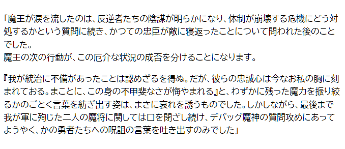
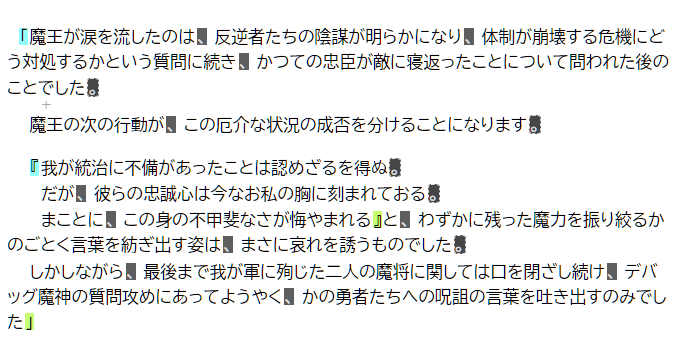

# Kugi Reader

日本語の区切り文字（句読点と括弧）を処理してネット記事を読みやすくするブックマークレットです。

## 機能

次の機能があります。

- 句点（マル）の後に改行を挿入する。
- 一文ごとに字下げする。
- 括弧の段数に応じて字下げを深くする。
- 句読点と括弧をハイライト（強調表示）する。
- 句読点と括弧に余白（マージン）を空ける。
- 句点直後の改行` `に記号（`+`）を表示する。
- 2度め以降の実行でスタイルシートのオン／オフを切り替える。

## ブックマークレット適用前後の画像

ブックマークレットを実行する前後の画像を見ることが分かりやすいでしょう。

この文章にたいして、ブックマークレットを実行すると、次の文章に変わって読みやすくなります。

## ブックマークレットのインストール方法

[このJavaScriptのプログラム](https://raw.githubusercontent.com/querykuma/KugiReader/main/dist/kugi_reader_bookmarklet_min.js) をブックマークのURL欄に貼り付けてブックマークレットを作成してください。

## ブックマークレットの使い方

ネット記事を閲覧しているときにブックマークレットをクリックすることによって起動します。

## その他

[全角ピリオド変換_bookmarklet_min.js](https://raw.githubusercontent.com/querykuma/KugiReader/main/dist/全角ピリオド変換_bookmarklet_min.js) は、全角ピリオドと全角カンマで全角句読点を代用する記事のために作った補助ブックマークレットで、全角ピリオドと全角カンマを全角句読点に変換します。

[en_kugi_reader_bookmarklet_min.js](https://raw.githubusercontent.com/querykuma/KugiReader/main/dist/en_kugi_reader_bookmarklet_min.js)はKugiReaderの英語版ブックマークレットです。簡易的に作成したものです。丸括弧で囲まれた部分を非強調表示して、句読点などの区切り文字を強調表示します。

GitHubレポジトリの [MakeBookmarklet](https://github.com/querykuma/MakeBookmarklet) はブックマークレットを出力するために私が作成したwebpackのプラグインです。
